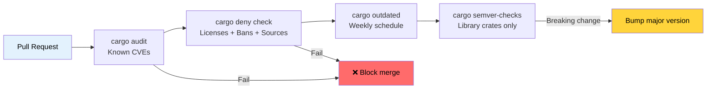

# Dependency Management and Supply Chain Security 🟢

> **What you'll learn:**
> - Scanning for known vulnerabilities with `cargo-audit`
> - Enforcing license, advisory, and source policies with `cargo-deny`
> - Supply chain trust verification with Mozilla's `cargo-vet`
> - Tracking outdated dependencies and detecting breaking API changes
> - Visualizing and deduplicating your dependency tree
>
> **Cross-references:** [Release Profiles](ch07-release-profiles-and-binary-size.md) — `cargo-udeps` trims unused dependencies found here · [CI/CD Pipeline](ch11-putting-it-all-together-a-production-cic.md) — audit and deny jobs in the pipeline · [Build Scripts](ch01-build-scripts-buildrs-in-depth.md) — `build-dependencies` are part of your supply chain too

A Rust binary doesn't just contain your code — it contains every transitive
dependency in your `Cargo.lock`. A vulnerability, license violation, or
malicious crate anywhere in that tree becomes *your* problem. This chapter
covers the tools that make dependency management auditable and automated.

### cargo-audit — Known Vulnerability Scanning

[`cargo-audit`](https://github.com/rustsec/rustsec/tree/main/cargo-audit)
checks your `Cargo.lock` against the [RustSec Advisory Database](https://rustsec.org/),
which tracks known vulnerabilities in published crates.

```bash
# Install
cargo install cargo-audit

# Scan for known vulnerabilities
cargo audit

# Output:
# Crate:     chrono
# Version:   0.4.19
# Title:     Potential segfault in localtime_r invocations
# Date:      2020-11-10
# ID:        RUSTSEC-2020-0159
# URL:       https://rustsec.org/advisories/RUSTSEC-2020-0159
# Solution:  Upgrade to >= 0.4.20

# Check and fail CI if vulnerabilities exist
cargo audit --deny warnings

# Generate JSON output for automated processing
cargo audit --json

# Fix vulnerabilities by updating Cargo.lock
cargo audit fix
```

**CI integration:**

```yaml
# .github/workflows/audit.yml
name: Security Audit
on:
  schedule:
    - cron: '0 0 * * *'  # Daily check — advisories appear continuously
  push:
    paths: ['Cargo.lock']

jobs:
  audit:
    runs-on: ubuntu-latest
    steps:
      - uses: actions/checkout@v4
      - uses: rustsec/audit-check@v2
        with:
          token: ${{ secrets.GITHUB_TOKEN }}
```

### cargo-deny — Comprehensive Policy Enforcement

[`cargo-deny`](https://github.com/EmbarkStudios/cargo-deny) goes far beyond
vulnerability scanning. It enforces policies across four dimensions:

1. **Advisories** — known vulnerabilities (like cargo-audit)
2. **Licenses** — allowed/denied license list
3. **Bans** — forbidden crates or duplicate versions
4. **Sources** — allowed registries and git sources

```bash
# Install
cargo install cargo-deny

# Initialize configuration
cargo deny init
# Creates deny.toml with documented defaults

# Run all checks
cargo deny check

# Run specific checks
cargo deny check advisories
cargo deny check licenses
cargo deny check bans
cargo deny check sources
```

**Example `deny.toml`:**

```toml
# deny.toml

[advisories]
vulnerability = "deny"        # Fail on known vulnerabilities
unmaintained = "warn"         # Warn on unmaintained crates
yanked = "deny"               # Fail on yanked crates
notice = "warn"               # Warn on informational advisories

[licenses]
unlicensed = "deny"           # All crates must have a license
allow = [
    "MIT",
    "Apache-2.0",
    "BSD-2-Clause",
    "BSD-3-Clause",
    "ISC",
    "Unicode-DFS-2016",
]
copyleft = "deny"             # No GPL/LGPL/AGPL in this project
default = "deny"              # Deny anything not explicitly allowed

[bans]
multiple-versions = "warn"    # Warn if same crate appears at 2 versions
wildcards = "deny"            # No path = "*" in dependencies
highlight = "all"             # Show all duplicates, not just first

# Ban specific problematic crates
deny = [
    # openssl-sys pulls in C OpenSSL — prefer rustls
    { name = "openssl-sys", wrappers = ["native-tls"] },
]

# Allow specific duplicate versions (when unavoidable)
[[bans.skip]]
name = "syn"
version = "1.0"               # syn 1.x and 2.x often coexist

[sources]
unknown-registry = "deny"     # Only allow crates.io
unknown-git = "deny"          # No random git dependencies
allow-registry = ["https://github.com/rust-lang/crates.io-index"]
```

**License enforcement** is particularly valuable for commercial projects:

```bash
# Check which licenses are in your dependency tree
cargo deny list

# Output:
# MIT          — 127 crates
# Apache-2.0   — 89 crates
# BSD-3-Clause — 12 crates
# MPL-2.0      — 3 crates   ← might need legal review
# Unicode-DFS  — 1 crate
```

### cargo-vet — Supply Chain Trust Verification

[`cargo-vet`](https://github.com/mozilla/cargo-vet) (from Mozilla) addresses a
different question: not "does this crate have known bugs?" but "has a trusted
human actually reviewed this code?"

```bash
# Install
cargo install cargo-vet

# Initialize (creates supply-chain/ directory)
cargo vet init

# Check which crates need review
cargo vet

# After reviewing a crate, certify it:
cargo vet certify serde 1.0.203
# Records that you've audited serde 1.0.203 for your criteria

# Import audits from trusted organizations
cargo vet import mozilla
cargo vet import google
cargo vet import bytecode-alliance
```

**How it works:**

```text
supply-chain/
├── audits.toml       ← Your team's audit certifications
├── config.toml       ← Trust configuration and criteria
└── imports.lock      ← Pinned imports from other organizations
```

`cargo-vet` is most valuable for organizations with strict supply-chain
requirements (government, finance, infrastructure). For most teams,
`cargo-deny` provides sufficient protection.

### cargo-outdated and cargo-semver-checks

**`cargo-outdated`** — find dependencies that have newer versions:

```bash
cargo install cargo-outdated

cargo outdated --workspace
# Output:
# Name        Project  Compat  Latest   Kind
# serde       1.0.193  1.0.203 1.0.203  Normal
# regex       1.9.6    1.10.4  1.10.4   Normal
# thiserror   1.0.50   1.0.61  2.0.3    Normal  ← major version available
```

**`cargo-semver-checks`** — detect breaking API changes before publishing.
Essential for library crates:

```bash
cargo install cargo-semver-checks

# Check if your changes are semver-compatible
cargo semver-checks

# Output:
# ✗ Function `parse_gpu_csv` is now private (was public)
#   → This is a BREAKING change. Bump MAJOR version.
#
# ✗ Struct `GpuInfo` has a new required field `power_limit_w`
#   → This is a BREAKING change. Bump MAJOR version.
#
# ✓ Function `parse_gpu_csv_v2` was added (non-breaking)
```

### cargo-tree — Dependency Visualization and Deduplication

`cargo tree` is built into Cargo (no installation needed) and is invaluable
for understanding your dependency graph:

```bash
# Full dependency tree
cargo tree

# Find why a specific crate is included
cargo tree --invert --package openssl-sys
# Shows all paths from your crate to openssl-sys

# Find duplicate versions
cargo tree --duplicates
# Output:
# syn v1.0.109
# └── serde_derive v1.0.193
#
# syn v2.0.48
# ├── thiserror-impl v1.0.56
# └── tokio-macros v2.2.0

# Show only direct dependencies
cargo tree --depth 1

# Show dependency features
cargo tree --format "{p} {f}"

# Count total dependencies
cargo tree | wc -l
```

**Deduplication strategy**: When `cargo tree --duplicates` shows the same crate
at two major versions, check if you can update the dependency chain to unify them.
Each duplicate adds compile time and binary size.

### Application: Multi-Crate Dependency Hygiene

The workspace uses `[workspace.dependencies]` for centralized
version management — an excellent practice. Combined with
[`cargo tree --duplicates`](ch07-release-profiles-and-binary-size.md) for size
analysis, this prevents version drift and reduces binary bloat:

```toml
# Root Cargo.toml — all versions pinned in one place
[workspace.dependencies]
serde = { version = "1.0", features = ["derive"] }
serde_json = { version = "1.0", features = ["preserve_order"] }
regex = "1.10"
thiserror = "1.0"
anyhow = "1.0"
rayon = "1.8"
```

**Recommended additions for the project:**

```bash
# Add to CI pipeline:
cargo deny init              # One-time setup
cargo deny check             # Every PR — licenses, advisories, bans
cargo audit --deny warnings  # Every push — vulnerability scanning
cargo outdated --workspace   # Weekly — track available updates
```

**Recommended `deny.toml` for the project:**

```toml
[advisories]
vulnerability = "deny"
yanked = "deny"

[licenses]
allow = ["MIT", "Apache-2.0", "BSD-2-Clause", "BSD-3-Clause", "ISC", "Unicode-DFS-2016"]
copyleft = "deny"     # Hardware diagnostics tool — no copyleft

[bans]
multiple-versions = "warn"   # Track duplicates, don't block yet
wildcards = "deny"

[sources]
unknown-registry = "deny"
unknown-git = "deny"
```

### Supply Chain Audit Pipeline



### 🏋️ Exercises

#### 🟢 Exercise 1: Audit Your Dependencies

Run `cargo audit` and `cargo deny init && cargo deny check` on any Rust project. How many advisories are found? How many license categories are in your tree?

<details>
<summary>Solution</summary>

```bash
cargo audit
# Note any advisories — often chrono, time, or older crates

cargo deny init
cargo deny list
# Shows license breakdown: MIT (N), Apache-2.0 (N), etc.

cargo deny check
# Shows full audit across all four dimensions
```
</details>

#### 🟡 Exercise 2: Find and Eliminate Duplicate Dependencies

Run `cargo tree --duplicates` on a workspace. Find a crate that appears at two versions. Can you update `Cargo.toml` to unify them? Measure the compile-time and binary-size impact.

<details>
<summary>Solution</summary>

```bash
cargo tree --duplicates
# Typical: syn 1.x and syn 2.x

# Find who pulls in the old version:
cargo tree --invert --package syn@1.0.109
# Output: serde_derive 1.0.xxx -> syn 1.0.109

# Check if a newer serde_derive uses syn 2.x:
cargo update -p serde_derive
cargo tree --duplicates
# If syn 1.x is gone, you've eliminated a duplicate

# Measure impact:
time cargo build --release  # Before and after
cargo bloat --release --crates | head -20
```
</details>

### Key Takeaways

- `cargo audit` catches known CVEs — run it on every push and on a daily schedule
- `cargo deny` enforces four policy dimensions: advisories, licenses, bans, and sources
- Use `[workspace.dependencies]` to centralize version management across a multi-crate workspace
- `cargo tree --duplicates` reveals bloat; each duplicate adds compile time and binary size
- `cargo-vet` is for high-security environments; `cargo-deny` is sufficient for most teams

---

