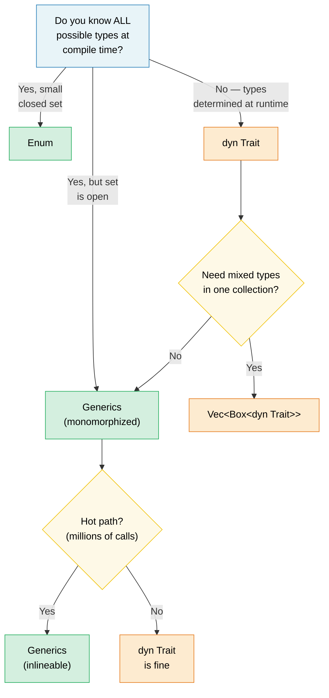

# 1. Generics — The Full Picture 🟢

> **What you'll learn:**
> - How monomorphization gives zero-cost generics — and when it causes code bloat
> - The decision framework: generics vs enums vs trait objects
> - Const generics for compile-time array sizes and `const fn` for compile-time evaluation
> - When to trade static dispatch for dynamic dispatch on cold paths

## Monomorphization and Zero Cost

Generics in Rust are **monomorphized** — the compiler generates a specialized copy of each generic function for every concrete type it's used with. This is the opposite of Java/C# where generics are erased at runtime.

```rust
fn max_of<T: PartialOrd>(a: T, b: T) -> T {
    if a >= b { a } else { b }
}

fn main() {
    max_of(3_i32, 5_i32);     // Compiler generates max_of_i32
    max_of(2.0_f64, 7.0_f64); // Compiler generates max_of_f64
    max_of("a", "z");         // Compiler generates max_of_str
}
```

**What the compiler actually produces** (conceptually):

```rust
// Three separate functions — no runtime dispatch, no vtable:
fn max_of_i32(a: i32, b: i32) -> i32 { if a >= b { a } else { b } }
fn max_of_f64(a: f64, b: f64) -> f64 { if a >= b { a } else { b } }
fn max_of_str<'a>(a: &'a str, b: &'a str) -> &'a str { if a >= b { a } else { b } }
```

> **Why does `max_of_str` need `<'a>` but `max_of_i32` doesn't?**  `i32` and `f64`
> are `Copy` types — the function returns an owned value. But `&str` is a reference,
> so the compiler must know the returned reference's lifetime. The `<'a>` annotation
> says "the returned `&str` lives at least as long as both inputs."

**Advantages**: Zero runtime cost — identical to hand-written specialized code. The optimizer can inline, vectorize, and specialize each copy independently.

**Comparison with C++**: Rust generics work like C++ templates but with one crucial difference — **bounds checking happens at definition, not instantiation**. In C++, a template compiles only when used with a specific type, leading to cryptic error messages deep in library code. In Rust, `T: PartialOrd` is checked when you define the function, so errors are caught early and messages are clear.

```rust,compile_fail
// Rust: error at definition site — "T doesn't implement Display"
fn broken<T>(val: T) {
    println!("{val}"); // ❌ Error: T doesn't implement Display
}
```

```rust
// Fix: add the bound
fn fixed<T: std::fmt::Display>(val: T) {
    println!("{val}"); // ✅
}
```

### When Generics Hurt: Code Bloat

Monomorphization has a cost — binary size. Each unique instantiation duplicates the function body:

```rust,ignore
// This innocent function...
fn serialize<T: serde::Serialize>(value: &T) -> Vec<u8> {
    serde_json::to_vec(value).unwrap()
}

// ...used with 50 different types → 50 copies in the binary.
```

**Mitigation strategies**:

```rust,ignore
// 1. Extract the non-generic core ("outline" pattern)
fn serialize<T: serde::Serialize>(value: &T) -> Result<Vec<u8>, serde_json::Error> {
    // Generic part: only the serialization call
    let json_value = serde_json::to_value(value)?;
    // Non-generic part: extracted into a separate function
    serialize_value(json_value)
}

fn serialize_value(value: serde_json::Value) -> Result<Vec<u8>, serde_json::Error> {
    // This function exists only ONCE in the binary
    serde_json::to_vec(&value)
}

// 2. Use trait objects (dynamic dispatch) when inlining isn't critical
fn log_item(item: &dyn std::fmt::Display) {
    // One copy — uses vtable for dispatch
    println!("[LOG] {item}");
}
```

> **Rule of thumb**: Use generics for hot paths where inlining matters.
> Use `dyn Trait` for cold paths (error handling, logging, configuration)
> where a vtable call is negligible.

### Generics vs Enums vs Trait Objects — Decision Guide

Three ways to handle "different types, same interface" in Rust:

| Approach | Dispatch | Known at | Extensible? | Overhead |
|----------|----------|----------|-------------|----------|
| **Generics** (`impl Trait` / `<T: Trait>`) | Static (monomorphized) | Compile time | ✅ (open set) | Zero — inlined |
| **Enum** | Match arm | Compile time | ❌ (closed set) | Zero — no vtable |
| **Trait object** (`dyn Trait`) | Dynamic (vtable) | Runtime | ✅ (open set) | Vtable pointer + indirect call |

```rust,ignore
// --- GENERICS: Open set, zero cost, compile-time ---
fn process<H: Handler>(handler: H, request: Request) -> Response {
    handler.handle(request) // Monomorphized — one copy per H
}

// --- ENUM: Closed set, zero cost, exhaustive matching ---
enum Shape {
    Circle(f64),
    Rect(f64, f64),
    Triangle(f64, f64, f64),
}

impl Shape {
    fn area(&self) -> f64 {
        match self {
            Shape::Circle(r) => std::f64::consts::PI * r * r,
            Shape::Rect(w, h) => w * h,
            Shape::Triangle(a, b, c) => {
                let s = (a + b + c) / 2.0;
                (s * (s - a) * (s - b) * (s - c)).sqrt()
            }
        }
    }
}
// Adding a new variant forces updating ALL match arms — the compiler
// enforces exhaustiveness. Great for "I control all the variants."

// --- TRAIT OBJECT: Open set, runtime cost, extensible ---
fn log_all(items: &[Box<dyn std::fmt::Display>]) {
    for item in items {
        println!("{item}"); // vtable dispatch
    }
}
```

**Decision flowchart**:



### Const Generics

Since Rust 1.51, you can parameterize types and functions over *constant values*, not just types:

```rust
// Array wrapper parameterized over size
struct Matrix<const ROWS: usize, const COLS: usize> {
    data: [[f64; COLS]; ROWS],
}

impl<const ROWS: usize, const COLS: usize> Matrix<ROWS, COLS> {
    fn new() -> Self {
        Matrix { data: [[0.0; COLS]; ROWS] }
    }

    fn transpose(&self) -> Matrix<COLS, ROWS> {
        let mut result = Matrix::<COLS, ROWS>::new();
        for r in 0..ROWS {
            for c in 0..COLS {
                result.data[c][r] = self.data[r][c];
            }
        }
        result
    }
}

// The compiler enforces dimensional correctness:
fn multiply<const M: usize, const N: usize, const P: usize>(
    a: &Matrix<M, N>,
    b: &Matrix<N, P>, // N must match!
) -> Matrix<M, P> {
    let mut result = Matrix::<M, P>::new();
    for i in 0..M {
        for j in 0..P {
            for k in 0..N {
                result.data[i][j] += a.data[i][k] * b.data[k][j];
            }
        }
    }
    result
}

// Usage:
let a = Matrix::<2, 3>::new(); // 2×3
let b = Matrix::<3, 4>::new(); // 3×4
let c = multiply(&a, &b);      // 2×4 ✅

// let d = Matrix::<5, 5>::new();
// multiply(&a, &d); // ❌ Compile error: expected Matrix<3, _>, got Matrix<5, 5>
```

> **C++ comparison**: This is similar to `template<int N>` in C++, but Rust
> const generics are type-checked eagerly and don't suffer from SFINAE complexity.

### Const Functions (const fn)

`const fn` marks a function as evaluable at compile time — Rust's equivalent
of C++ `constexpr`. The result can be used in `const` and `static` contexts:

```rust
// Basic const fn — evaluated at compile time when used in const context
const fn celsius_to_fahrenheit(c: f64) -> f64 {
    c * 9.0 / 5.0 + 32.0
}

const BOILING_F: f64 = celsius_to_fahrenheit(100.0); // Computed at compile time
const FREEZING_F: f64 = celsius_to_fahrenheit(0.0);  // 32.0

// Const constructors — create statics without lazy_static!
struct BitMask(u32);

impl BitMask {
    const fn new(bit: u32) -> Self {
        BitMask(1 << bit)
    }

    const fn or(self, other: BitMask) -> Self {
        BitMask(self.0 | other.0)
    }

    const fn contains(&self, bit: u32) -> bool {
        self.0 & (1 << bit) != 0
    }
}

// Static lookup table — no runtime cost, no lazy initialization
const GPIO_INPUT:  BitMask = BitMask::new(0);
const GPIO_OUTPUT: BitMask = BitMask::new(1);
const GPIO_IRQ:    BitMask = BitMask::new(2);
const GPIO_IO:     BitMask = GPIO_INPUT.or(GPIO_OUTPUT);

// Register maps as const arrays:
const SENSOR_THRESHOLDS: [u16; 4] = {
    let mut table = [0u16; 4];
    table[0] = 50;   // Warning
    table[1] = 70;   // High
    table[2] = 85;   // Critical
    table[3] = 100;  // Shutdown
    table
};
// The entire table exists in the binary — no heap, no runtime init.
```

**What you CAN do in `const fn`** (as of Rust 1.79+):
- Arithmetic, bit operations, comparisons
- `if`/`else`, `match`, `loop`, `while` (control flow)
- Creating and modifying local variables (`let mut`)
- Calling other `const fn`s
- References (`&`, `&mut` — within the const context)
- `panic!()` (becomes a compile error if reached at compile time)
- Basic floating-point arithmetic (`+`, `-`, `*`, `/`; complex ops like `sqrt`/`sin` are not const-eligible)

**What you CANNOT do** (yet):
- Heap allocation (`Box`, `Vec`, `String`)
- Trait method calls (only inherent methods)
- I/O or side effects

```rust
// const fn with panic — becomes a compile-time error:
const fn checked_div(a: u32, b: u32) -> u32 {
    if b == 0 {
        panic!("division by zero"); // Compile error if b is 0 at const time
    }
    a / b
}

const RESULT: u32 = checked_div(100, 4);  // ✅ 25
// const BAD: u32 = checked_div(100, 0);  // ❌ Compile error: "division by zero"
```

> **C++ comparison**: `const fn` is Rust's `constexpr`. The key difference:
> Rust's version is opt-in and the compiler rigorously verifies that only
> const-compatible operations are used. In C++, `constexpr` functions can
> silently fall back to runtime evaluation — in Rust, a `const` context
> *requires* compile-time evaluation or it's a hard error.

> **Practical advice**: Make constructors and simple utility functions `const fn`
> whenever possible — it costs nothing and enables callers to use them in const
> contexts. For hardware diagnostic code, `const fn` is ideal for register
> definitions, bitmask construction, and threshold tables.

> **Key Takeaways — Generics**
> - Monomorphization gives zero-cost abstractions but can cause code bloat — use `dyn Trait` for cold paths
> - Const generics (`[T; N]`) replace C++ template tricks with compile-time–checked array sizes
> - `const fn` eliminates `lazy_static!` for compile-time–computable values

> **See also:** [Ch 2 — Traits In Depth](ch02-traits-in-depth.md) for trait bounds, associated types, and trait objects. [Ch 4 — PhantomData](ch04-phantomdata-types-that-carry-no-data.md) for zero-sized generic markers.

---

### Exercise: Generic Cache with Eviction ★★ (~30 min)

Build a generic `Cache<K, V>` struct that stores key-value pairs with a configurable maximum capacity. When full, the oldest entry is evicted (FIFO). Requirements:

- `fn new(capacity: usize) -> Self`
- `fn insert(&mut self, key: K, value: V)` — evicts the oldest if at capacity
- `fn get(&self, key: &K) -> Option<&V>`
- `fn len(&self) -> usize`
- Constrain `K: Eq + Hash + Clone`

<details>
<summary>🔑 Solution</summary>

```rust
use std::collections::{HashMap, VecDeque};
use std::hash::Hash;

struct Cache<K, V> {
    map: HashMap<K, V>,
    order: VecDeque<K>,
    capacity: usize,
}

impl<K: Eq + Hash + Clone, V> Cache<K, V> {
    fn new(capacity: usize) -> Self {
        Cache {
            map: HashMap::with_capacity(capacity),
            order: VecDeque::with_capacity(capacity),
            capacity,
        }
    }

    fn insert(&mut self, key: K, value: V) {
        if self.capacity == 0 {
            // no capacity!
            return;
        }
        if self.map.contains_key(&key) {
            self.map.insert(key, value);
            return;
        }
        if self.map.len() >= self.capacity {
            if let Some(oldest) = self.order.pop_front() {
                self.map.remove(&oldest);
            }
        }
        self.order.push_back(key.clone());
        self.map.insert(key, value);
    }

    fn get(&self, key: &K) -> Option<&V> {
        self.map.get(key)
    }

    fn len(&self) -> usize {
        self.map.len()
    }
}

fn main() {
    // Test of a basic cache
    let mut cache = Cache::new(3);
    cache.insert("a", 1);
    cache.insert("b", 2);
    cache.insert("c", 3);
    assert_eq!(cache.len(), 3);

    cache.insert("d", 4); // Evicts "a"
    assert_eq!(cache.get(&"a"), None);
    assert_eq!(cache.get(&"d"), Some(&4));

    // Left to the reader: what type should `capacity` attribute be,
    // to ensure that such a useless cache cannot be defined?
    let mut empty_cache = Cache::new(0);
    empty_cache.insert("0", 0);
    assert_eq!(empty_cache.get(&"0"), None);
    assert_eq!(empty_cache.len(), 0);

    println!("Cache works! len = {}", cache.len());
}
```

</details>

***

